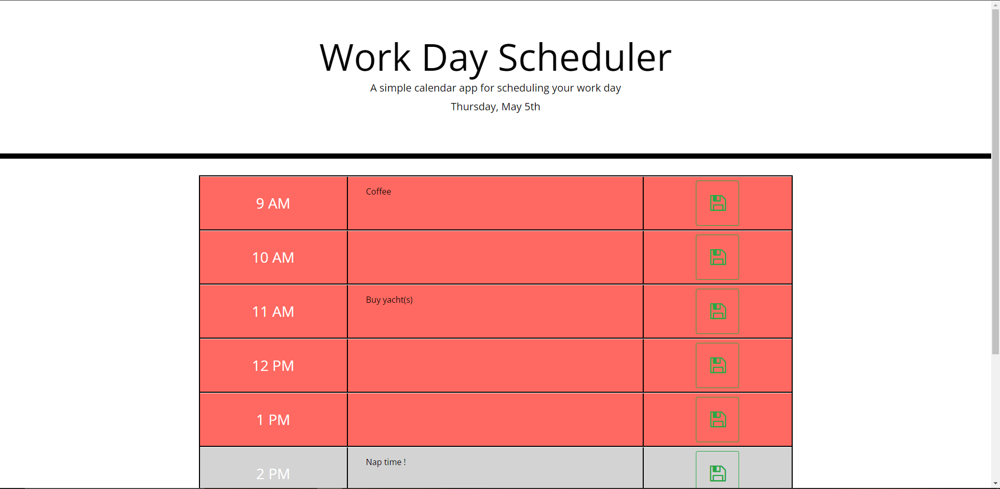

# day-planner

## Description
    This page is a day planner that updates its css dynamically based on the time of day. With it a user can save their daily to-dos locally and have a visual aid of how much of their work day is left.

## Usage
    To use the application a user must simply click on the text area in the hour row of their choosing and add or delete text to their hearts content. When done, clicking the 'save' button will save the text to local storage to be accessed later without keeping the page open in their browser.

    Sceeenshot of application below:

## Deployed Application Link
https://eyesackel.github.io/day-planner